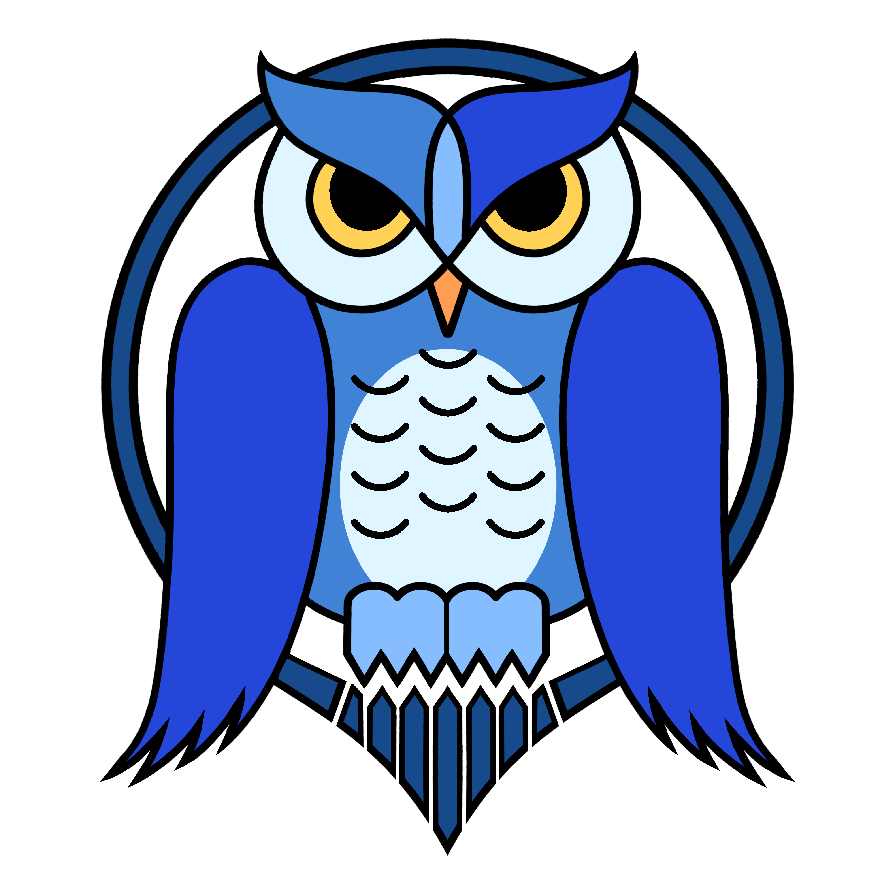
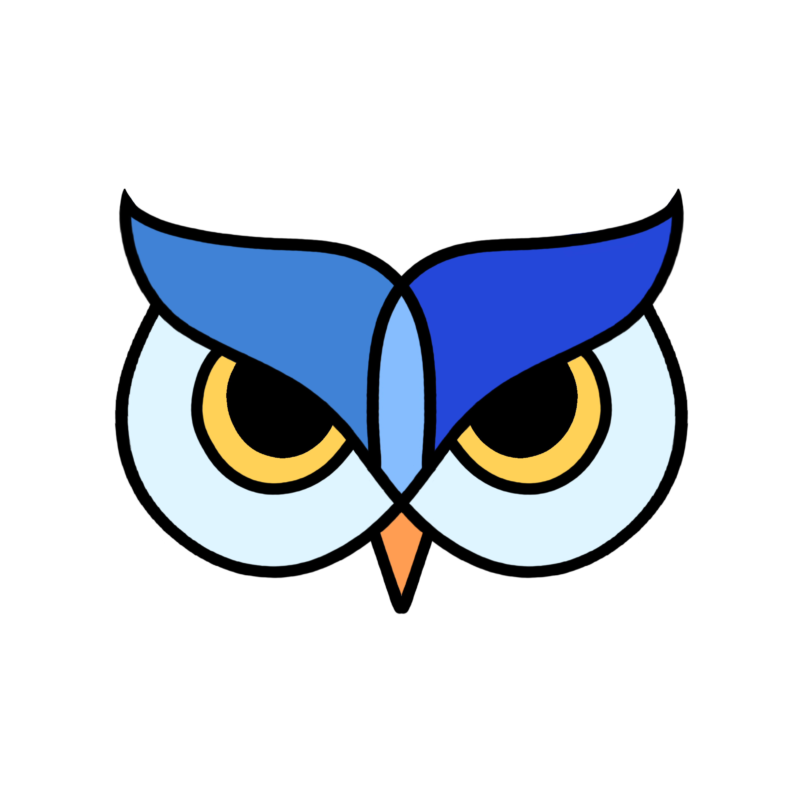

<div align="center">



# ForgeRealm

**A 3D printing & design studio. Forged in Leeds.**

Eco-friendly figurines, ambient lamps, tabletop pieces, and the odd articulated dragon.
Designed in our workshop, printed on biodegradable PLA, finished by hand.

<br/>

[](https://astro.build)
[](https://react.dev)
[](https://www.typescriptlang.org)
[](https://tailwindcss.com)
[](https://stripe.com)
[](#-what-we-believe)
[](#-find-us)

<br/>

[**Shop**](https://forgerealm.co.uk/shop)
&nbsp;·&nbsp;
[**Stall Chronicles**](https://forgerealm.co.uk/blog)
&nbsp;·&nbsp;
[**Commission a piece**](https://forgerealm.co.uk/custom-order)
&nbsp;·&nbsp;
[**Get on the list**](https://forgerealm.co.uk/subscribe)

</div>

---

> _"We build realms of possibility, one layer at a time."_

---

## ✦ The realm

ForgeRealm is a UK-based 3D printing and design studio that blends creativity, precision, and sustainability. Every piece is designed, printed, and hand-finished in our Leeds workshop, on biodegradable PLA, with the patience to make it actually look good.

|  Figurines  |  Home decor  |  Functional  |  Prototypes  |
|:---:|:---:|:---:|:---:|
| Fantasy minis & collectibles | Lamps, wall art, displays | Organisers, holders, accessories | Concept models for indie designers |

---

## ✦ What we believe

- 🌱 &nbsp;**Sustainable** &middot; 100% biodegradable PLA, low-waste packaging
- ⚙️ &nbsp;**Durable** &middot; engineered prints, not throwaway novelties
- 🎨 &nbsp;**Customisable** &middot; commissions tailored to your idea
- 💡 &nbsp;**Innovative** &middot; old-school craft meets new-school tech

---

## ✦ Under the hood

This repo powers **[forgerealm.co.uk](https://forgerealm.co.uk)** end to end, frontend through checkout to receipts.

| Layer | Stack |
|---|---|
| **Frontend** | Astro 5, React 19, Tailwind 3, Framer Motion, Spline 3D |
| **Backend** | Node + Express, MySQL, JWT auth |
| **Email** | Brevo (transactional + mailing list) |
| **Payments** | Stripe Checkout + webhooks, PDF invoices via PDFKit |

### Run it locally

```bash
# install deps
npm install
cd backend && npm install && cd ..

# spin up frontend + backend together
npm run dev:all
```

Frontend lives at `http://localhost:4321`. Backend port is set in `backend/.env`.

---

## ✦ Find us

<table>
  <tr>
    <td width="40">📍</td><td><strong>Workshop</strong></td><td>Leeds, United Kingdom</td>
  </tr>
  <tr>
    <td>📧</td><td><strong>Email</strong></td><td><a href="mailto:info@forgerealm.co.uk">info@forgerealm.co.uk</a></td>
  </tr>
  <tr>
    <td>📞</td><td><strong>Phone</strong></td><td>+44 (0) 7947 636 347</td>
  </tr>
  <tr>
    <td>🌐</td><td><strong>Website</strong></td><td><a href="https://forgerealm.co.uk">forgerealm.co.uk</a></td>
  </tr>
</table>

### Hours

| Day | Hours |
|:--|:--|
| Monday to Friday | 08:00 to 18:00 |
| Saturday | 10:00 to 16:00 |
| Sunday | Closed |

### Follow the journey

[](https://instagram.com/forgerealm)
[](https://threads.net/@forgerealm3d)
[](https://x.com/forgerealm3d)

---

## ✦ Collaborations

We're up for working with:

- **Designers & artists** bringing digital concepts into the real world
- **Small businesses** wanting bespoke displays, signage, or accessories
- **Gamers & creators** chasing unique collectibles or tabletop pieces

Drop us a line at **info@forgerealm.co.uk** if any of that sounds like you.

---

<div align="center">



**ForgeRealm Ltd** &middot; designed and crafted in the United Kingdom

<sub>© 2026 ForgeRealm. All rights reserved.</sub>

</div>

<!-- DAILY_PULSE_START -->
## Daily Project Pulse

This section is auto-updated daily to track repository health and momentum.

- **Snapshot Date (UTC):** 2026-06-08
- **Project Start (first commit):** 2025-10-02
- **Total Commits:** 428
- **Tracked Files:** 251
- **Latest Commit:** 79917fb - docs: update daily project pulse (2026-06-07)

### Recent Activity
- 2026-06-07 | 79917fb | docs: update daily project pulse
- 2026-06-06 | 89b38e5 | docs: update daily project pulse
- 2026-06-05 | fdeccdd | docs: update daily project pulse
- 2026-06-05 | 5cfa98a | Merge pull request #87 from ForgeRealmLTD/claude/blog-concise-notes
- 2026-06-05 | e5373fd | blog: tighten studio notes for brevity

_Generated by `.github/workflows/daily-readme-pulse.yml` using `scripts/update-readme-pulse.js`._
<!-- DAILY_PULSE_END -->
